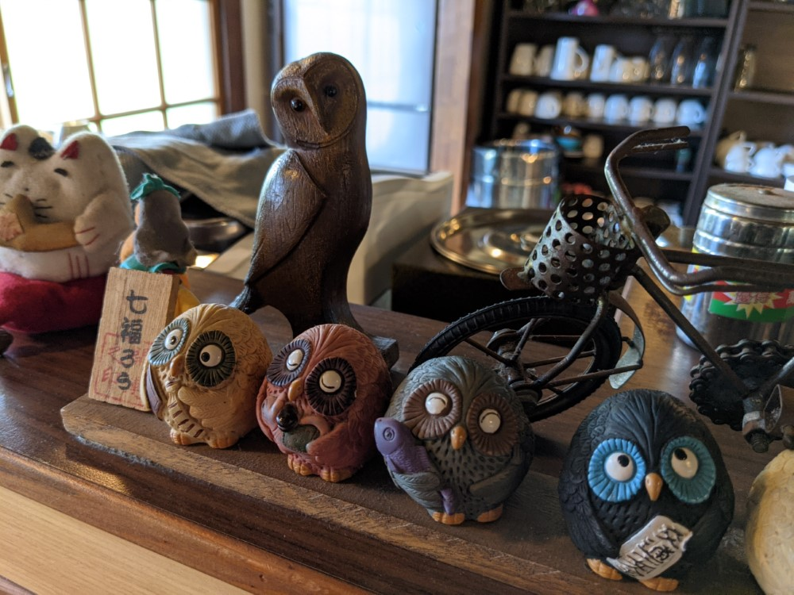
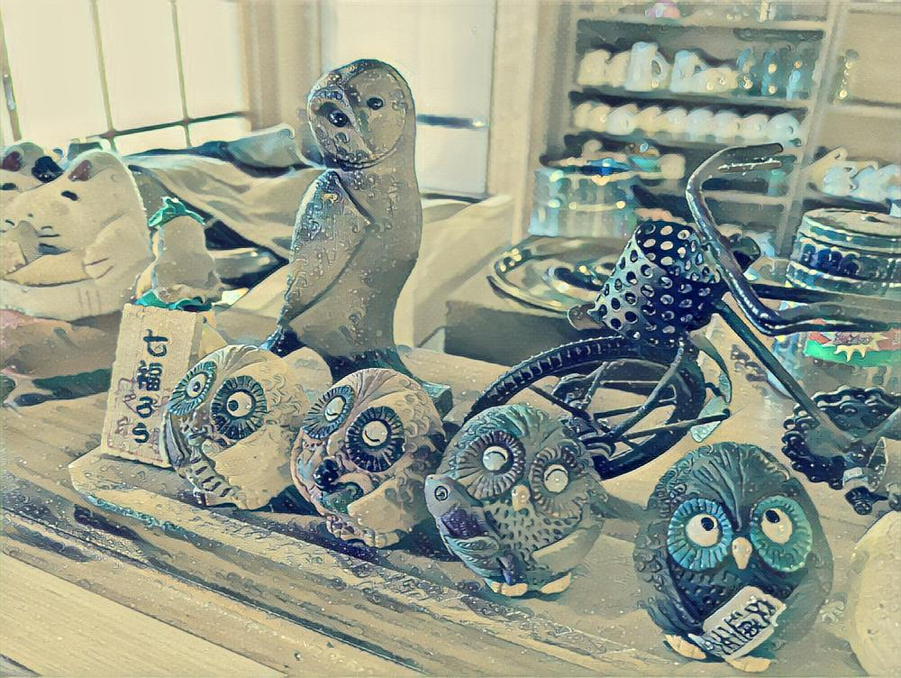
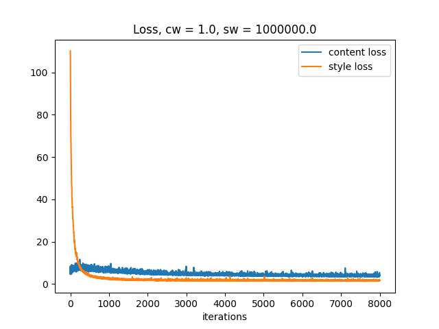

# Image Style Transfer CNN
A Convolutional Neural Network (CNN) to transfer the style of a reference image onto a target image. 

## Results
| Style Image | Target Image | Style Transferred Image |
|:--:|:--:|:--:|
|  |  |  |

Loss plot over 8000 iterations:  
  

## Requirements
The root folder should be structured as follows:
```
📁 root/
  ├─ 📁 src/
  |  ├─ 📄 transformer_net.py
  |  ├─ 📄 vgg.py
  |  └─ 📄 utils.py
  ├─ 📄 train.py
  ├─ 📄 eval.py
  └─ 📄 webcam.py
```

COCO2014 dataset: [https://cocodataset.org/#download](https://cocodataset.org/#download)
The dataset folder should be structured as follows:
```
📁 dataset/
  └─ 📁 train/
     ├─ 📷 COCO_train2014_000000356767.jpg
     ├─ 📷 COCO_train2014_000000356771.jpg
     └─ ...
```

### Dependencies  
```
matplotlib==3.5.1
opencv_python==4.5.5.64
Pillow==9.0.1
torch==1.9.0+cu102
torchvision==0.10.0+cu102
tqdm==4.62.3
```

## How to use
### Train
Run the following code to train  
```bash
python train.py
```

By default, the script will first ask the directory to the dataset folder.  
Then, it will ask for the style image and your target test image.  
The script will generate checkpoint .pth files every `CHKPT_FREQ` in a `model/<style image name>` folder created in the root folder, and will also generate style transfered test images every `TEST_FREQ` in the `model/<style image name>/test images` folder.

### Training Parameters
Global parameters can be tinkered in the script:
```python
MODEL_FOLDER    # where to save the model .pth files
CONTINUE        # continue training with selected model .pth file, set to None to disable

EPOCHS          # epochs
LR              # learning rate
BATCH_SIZE      # batch size
TRAIN_IMG_SIZE  # resize the dataset images during training
CONTENT_WEIGHT
STYLE_WEIGHT
CHKPT_FREQ      # save checkpoint model .pth every x iteration, set to 0 to disable checkpoints
TEST_FREQ       # save a test image every x iteration, set to 0 to disable test images
```

### Evaluation
Run the following code to evaluate:  
```bash
python eval.py
```

By default, the script will ask for the model .pth file, then your target image.
The script will generate a style transferred image in a `results` folder created in the root folder.

An example model file is provided in the `_docs` folder.

### Webcam
Run the following code to perform style transfer in real time using your webcam:  
```bash
python webcam.py
```

The script will ask for the model .pth file, then open a window showing a style transferred video stream of your webcam.